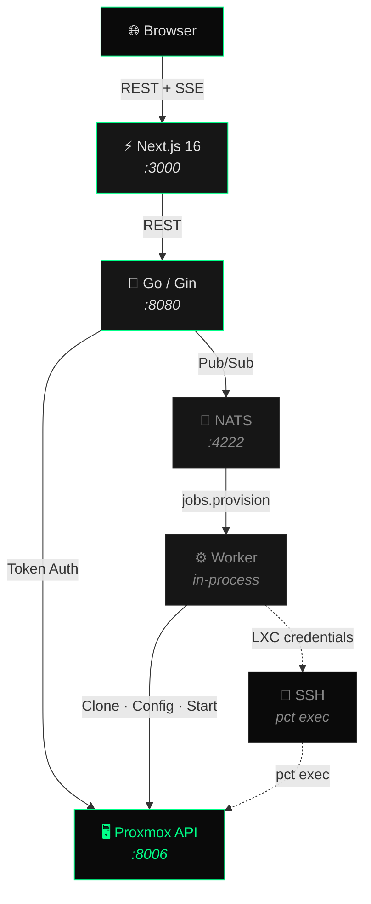

<p align="center">
  <h1 align="center">PVE Pilot</h1>
  <p align="center">
    A lightweight, open-source Proxmox VE management dashboard.<br/>
    Go backend &bull; Next.js frontend &bull; NATS message queue
  </p>
</p>

<p align="center">
  <a href="#features">Features</a> &bull;
  <a href="#quick-start">Quick Start</a> &bull;
  <a href="#architecture">Architecture</a> &bull;
  <a href="#configuration">Configuration</a> &bull;
  <a href="#api-reference">API Reference</a> &bull;
  <a href="CONTRIBUTING.md">Contributing</a>
</p>

---

## Features

### Provisioning
- **Async VM & container creation** from templates via NATS job queue with real-time SSE progress
- **Distro-aware templates** with auto-detected SSH user (Ubuntu, Rocky, Alma, Debian)
- **Cloud-init** configuration: user, password, SSH keys, DNS domain
- **User-data scripts** executed via QEMU guest agent after boot
- **LXC credential injection** via SSH to Proxmox host (`pct exec`)
- **Custom template selector** with distro icons
- **Storage selection** (excludes `local`), extra data volumes, auto-assigned VMIDs (10000+)

### Management
- **VM & container grid views** with distro icons, CPU/RAM bars, click-through to detail pages
- **Detail pages** with resource gauges, network interfaces, filesystem usage (guest agent), build info
- **Vertical scaling** &mdash; CPU/memory changes (VMs: stop &rarr; apply &rarr; start; LXC: hot update)
- **Disk resize** &mdash; hot grow for both VMs and containers
- **Volume attach** &mdash; hot-attach new SCSI disks (VMs) or mount points (LXC)
- **Reinstall OS** &mdash; delete and re-provision keeping the same VMID, name, and credentials

### Backup & Restore
- **Instant backups** to configurable storage with zstd compression
- **Restore in-place** (stop &rarr; delete &rarr; restore same VMID) or **as new instance** (auto VMID)
- **Scheduled backups** via Proxmox's built-in scheduler: daily, weekly, monthly presets
- **Backup history** with size, date, notes, and delete

### Infrastructure
- **NATS** message queue for async job processing
- **SSE** (Server-Sent Events) for real-time progress updates
- **Job tracking** with in-memory store and pub/sub for SSE subscribers
- **Build credentials** persisted in localStorage (survives page refresh)
- **Dark theme** &mdash; `#0a0a0a` background, `#00ff88` accent

---

## Quick Start

### Prerequisites

- [Docker](https://docs.docker.com/get-docker/) and Docker Compose
- A Proxmox VE host with an API token

### 1. Create a Proxmox API Token

In the Proxmox web UI:

1. Go to **Datacenter &rarr; Permissions &rarr; API Tokens**
2. Click **Add**
3. User: `root@pam`, Token ID: `pilot`, uncheck **Privilege Separation**
4. Copy the token secret (shown only once)
5. Grant permissions:
   ```bash
   pveum aclmod / -token 'root@pam!pilot' -role PVEAdmin
   ```

### 2. Configure

```bash
cp .env.example .env
# Edit .env with your Proxmox URL, token ID, and token secret
```

### 3. Run

```bash
docker compose build
docker compose up -d
```

Open **http://localhost:3000**

### 4. (Optional) Enable LXC credential injection

To set passwords and SSH keys on LXC containers, PVE Pilot needs SSH access to the Proxmox host:

```bash
# In .env, uncomment and set:
PROXMOX_SSH_HOST=192.168.1.100
PROXMOX_SSH_USER=root
PROXMOX_SSH_KEY_HOST_PATH=/home/you/.ssh/id_ed25519
```

Restart with `docker compose up -d`.

---

## Architecture



### Services

| | Service | Stack | Port | Role |
|:--|---------|-------|:----:|------|
| 📨 | **nats** | `nats:2-alpine` | `4222` `8222` | Message queue with JetStream |
| 🔧 | **backend** | Go 1.25 &bull; Gin &bull; NATS client | `8080` | REST API, async worker, SSE streams |
| ⚡ | **frontend** | Next.js 16 &bull; React 19 &bull; Tailwind v4 | `3000` | Dashboard UI |

---

## Configuration

> Copy `.env.example` to `.env` and fill in your values. See the file for inline documentation.

### Proxmox Connection

| Variable | Required | Default | Description |
|:---------|:--------:|:--------|:------------|
| `PROXMOX_URL` | ✅ | &mdash; | Proxmox API URL &mdash; `https://host:8006` |
| `PROXMOX_TOKEN_ID` | ✅ | &mdash; | API token ID &mdash; `user@realm!tokenid` |
| `PROXMOX_TOKEN_SECRET` | ✅ | &mdash; | API token secret (UUID) |
| `INSECURE_TLS` | | `true` | Skip TLS verification for self-signed PVE certs |

### Application

| Variable | Required | Default | Description |
|:---------|:--------:|:--------|:------------|
| `FRONTEND_URL` | | `http://localhost:3000` | Frontend origin for CORS |
| `NEXT_PUBLIC_API_URL` | | `http://localhost:8080` | API URL used by frontend at build time |
| `DNS_DOMAIN` | | &mdash; | Search domain set on VMs via cloud-init |
| `BACKUP_STORAGE` | | `nfs-drive` | Proxmox storage pool for vzdump backups |

### LXC Credential Injection <sub>(optional)</sub>

> Required only if you want to set passwords, SSH keys, or run user-data scripts inside **LXC containers**. QEMU VMs use the guest agent instead.

| Variable | Required | Default | Description |
|:---------|:--------:|:--------|:------------|
| `PROXMOX_SSH_HOST` | | &mdash; | Proxmox host IP or hostname |
| `PROXMOX_SSH_PORT` | | `22` | SSH port |
| `PROXMOX_SSH_USER` | | `root` | SSH user with `pct exec` access |
| `PROXMOX_SSH_KEY_HOST_PATH` | | &mdash; | Path on Docker host to SSH private key (mounted read-only) |

---

## API Reference

<details>
<summary><strong>Cluster</strong></summary>

| Method | Path | Description |
|--------|------|-------------|
| GET | `/api/health` | Health check |
| GET | `/api/settings` | Public config (dns_domain) |
| GET | `/api/cluster/summary` | Aggregated cluster stats |
| GET | `/api/cluster/resources` | All cluster resources |
| GET | `/api/nodes` | List nodes |
| GET | `/api/nodes/:node/status` | Node details |
| GET | `/api/nodes/:node/storage` | Storage pools |
| GET | `/api/templates` | List all templates |
| GET | `/api/next-vmid` | Next available VMID (10000+) |

</details>

<details>
<summary><strong>Virtual Machines</strong></summary>

| Method | Path | Description |
|--------|------|-------------|
| GET | `/api/nodes/:node/vms` | List VMs |
| GET | `/api/nodes/:node/vms/:vmid/status` | VM status |
| GET | `/api/nodes/:node/vms/:vmid/config` | VM configuration |
| GET | `/api/nodes/:node/vms/:vmid/interfaces` | Network interfaces (guest agent) |
| GET | `/api/nodes/:node/vms/:vmid/filesystems` | Filesystem usage (guest agent) |
| GET | `/api/nodes/:node/vms/:vmid/backups` | List backups for VM |
| POST | `/api/nodes/:node/vms/:vmid/start` | Start VM |
| POST | `/api/nodes/:node/vms/:vmid/stop` | Stop VM |
| POST | `/api/nodes/:node/vms/:vmid/reboot` | Reboot VM |
| POST | `/api/nodes/:node/vms/:vmid/clone` | Clone VM |
| POST | `/api/nodes/:node/vms/:vmid/provision` | Provision VM (async, returns job_id) |
| POST | `/api/nodes/:node/vms/:vmid/scale` | Scale CPU/memory (stop+start if running) |
| POST | `/api/nodes/:node/vms/:vmid/resize-disk` | Resize disk (hot, grow only) |
| POST | `/api/nodes/:node/vms/:vmid/add-disk` | Attach new disk (auto scsiN) |
| POST | `/api/nodes/:node/vms/:vmid/backup` | Instant backup |
| DELETE | `/api/nodes/:node/vms/:vmid` | Delete VM |

</details>

<details>
<summary><strong>Containers</strong></summary>

| Method | Path | Description |
|--------|------|-------------|
| GET | `/api/nodes/:node/containers` | List containers |
| GET | `/api/nodes/:node/containers/:vmid/status` | Container status |
| GET | `/api/nodes/:node/containers/:vmid/config` | Container configuration |
| GET | `/api/nodes/:node/containers/:vmid/interfaces` | Network interfaces |
| GET | `/api/nodes/:node/containers/:vmid/backups` | List backups for container |
| POST | `/api/nodes/:node/containers/:vmid/start` | Start container |
| POST | `/api/nodes/:node/containers/:vmid/stop` | Stop container |
| POST | `/api/nodes/:node/containers/:vmid/reboot` | Reboot container |
| POST | `/api/nodes/:node/containers/:vmid/clone` | Clone container |
| POST | `/api/nodes/:node/containers/:vmid/provision` | Provision container (async) |
| POST | `/api/nodes/:node/containers/:vmid/scale` | Scale CPU/memory (hot) |
| POST | `/api/nodes/:node/containers/:vmid/resize-disk` | Resize disk (hot) |
| POST | `/api/nodes/:node/containers/:vmid/add-volume` | Attach new volume (mpN) |
| POST | `/api/nodes/:node/containers/:vmid/backup` | Instant backup |
| DELETE | `/api/nodes/:node/containers/:vmid` | Delete container |

</details>

<details>
<summary><strong>Backup & Restore</strong></summary>

| Method | Path | Description |
|--------|------|-------------|
| DELETE | `/api/backups?node=X&volid=Y` | Delete a backup |
| POST | `/api/nodes/:node/restore/vm` | Restore VM from backup |
| POST | `/api/nodes/:node/restore/container` | Restore container from backup |
| GET | `/api/backup-schedules` | List backup schedules |
| POST | `/api/backup-schedules` | Create backup schedule |
| DELETE | `/api/backup-schedules/:id` | Delete backup schedule |

</details>

<details>
<summary><strong>Jobs</strong></summary>

| Method | Path | Description |
|--------|------|-------------|
| GET | `/api/jobs` | List all jobs |
| GET | `/api/jobs/:id` | Get job status |
| GET | `/api/jobs/:id/events` | SSE stream for job progress |

</details>

---

## Development

```bash
# Backend (Go)
cd backend && go run .

# Frontend (Next.js)
cd frontend && npm run dev

# Both via Docker
docker compose build && docker compose up -d

# Logs
docker compose logs backend -f
docker compose logs frontend -f
```

---

## Contributing

See [CONTRIBUTING.md](CONTRIBUTING.md) for development guidelines, code style, and how to submit pull requests.

---

## License

MIT
